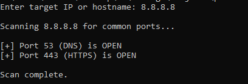

# Port Scanner

This is a simple Python script that scans a target IP address or hostname for the most commonly used TCP ports. It attempts to connect to each port and reports which ones are open.

## Skills Demonstrated

- Uses Python's `socket` library to establish TCP connections and scan for open ports
- Implements basic network automation to detect live services on a target host
- Applies structured logic and iteration to handle port lists efficiently
- Builds command-line tools that accept user input and respond with clean, readable output
- Understands core networking concepts like TCP handshakes, service ports, and timeouts
- Demonstrates security awareness by focusing on non-intrusive, common port checks

### Implementations

Port scanning is one of the first steps in network reconnaissance and vulnerability assessment. This tool can help identify which services are exposed on a system, making it easier to audit configurations, detect misconfigurations, or perform pre-penetration testing in authorized environments. Understanding and scripting port scans also builds foundational knowledge for blue team monitoring and red team simulation work both valuable in cybersecurity operations.

## How It Works
- The script uses Python’s built-in `socket` module
- It scans a predefined list of common ports (e.g., 22 for SSH, 80 for HTTP, 443 for HTTPS)
- If a connection to a port succeeds, it’s marked as open

## Usage
1. Make sure you have Python 3 installed
2. Run the script:
   ```bash
    port-scanner.py




